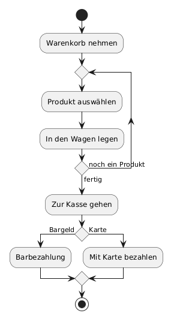
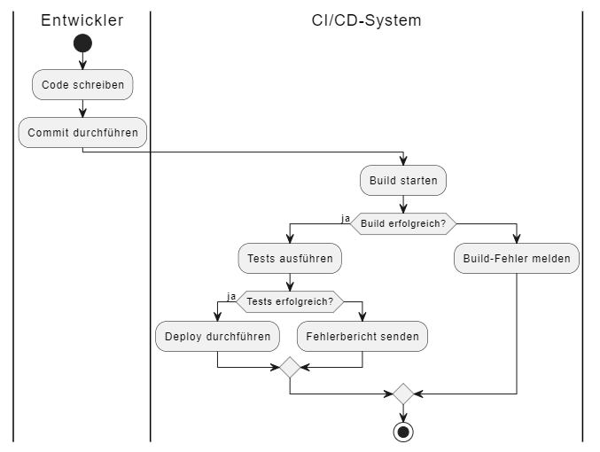
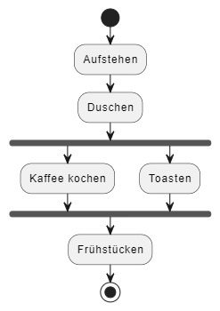

# Einführung ins Aktivitätsdiagramm

## Definition
Ein Aktivitätsdiagramm visualisiert den Ablauf von Arbeits- oder Prozessschritten in einem System. Es zeigt Aktionen, Entscheidungen und Parallelitäten.

## Zweck & Verwendung
- **Prozessmodellierung**: Beschreibung von Workflows (z. B. Bestell- oder Freigabeprozesse)  
- **Analyse**: Erkennen von Engpässen und Optimierungspotenzial  
- **Dokumentation**: Klare Darstellung von Abläufen für Entwickler und Business

## Praxisrelevanz
- Schnelle Identifikation von Prozessschritten  
- Verbesserte Kommunikation zwischen Fachbereich und IT  
- Grundlage für Automatisierung und Testskripte

## Grundelemente
- **Startknoten**: Schwarzer Kreis  
- **Aktivität**: Abgerundetes Rechteck mit Bezeichnung  
- **Entscheidung**: Raute mit Bedingungen („[Bedingung]“)  
- **Zusammenführung**: Raute ohne Bedingung  
- **Endknoten**: Umrahmter schwarzer Kreis  
- **Kontrollfluss**: Pfeile zwischen Knoten 

### Unterschiedliche Elemente zum Flowchart 
- **Partitionen**: Schwimbahnen (wer in einem Prozess welche Aufgaben übernimmt)

- **Parallelität**: Balken („Fork“/„Join“)

## OOP-Bezug
Aktivitätsdiagramme ergänzen Klassendiagramme, indem sie Objektverhalten und Methodenabläufe sichtbar machen.

## Tools & Links
- [Ralph Steyer - UML](https://www.linkedin.com/learning/uml-anwendungsfall-objekt-und-sequenzdiagramme/grundprinzipien-eines-aktivitatsdiagramms?u=371469706)
- [PlantUML Aktivitätsdiagramm-Syntax](https://plantuml.com/de/activity-diagram-beta)  
- [PlantUML - Blog](https://oer-informatik.de/uml-aktivitaetsdiagramm-plantuml)
- [Wikipedia-Artikel](https://de.wikipedia.org/wiki/Aktivit%C3%A4tsdiagramm)
- [Index-UML-Startseite](../_01uebersicht.md)