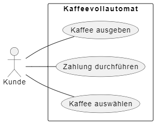
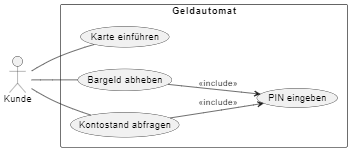
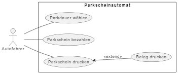
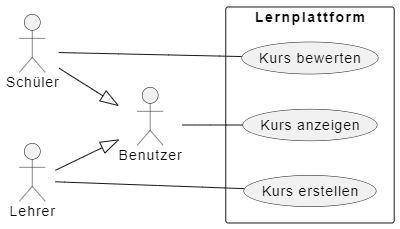

# Einführung ins Anwendungsfalldiagramm

## Definition
Ein Anwendungsfalldiagramm (Use-Case-Diagramm) stellt dar, welche Funktionen ein System aus Sicht der Nutzer (Akteure) bereitstellt.

## Zweck & Verwendung
- **Anforderungsanalyse**: Identifikation und Beschreibung von Systemfunktionen  
- **Kommunikation**: Gemeinsames Verständnis zwischen Fachbereich und Entwicklung  
- **Abgrenzung**: Klare Systemgrenze und Verantwortlichkeiten

## Praxisrelevanz
- Schnelle Erfassung der wichtigsten Use Cases  
- Basis für User Stories und Testszenarien  
- Übersichtliche Darstellung komplexer Systeme

## Grundelemente
- **Akteur**: Externe Entität (Person, System)  
- **Anwendungsfall**: Funktion oder Dienst, den das System für den Akteur bereitstellt  
- **Systemgrenze**: Rahmen, der das betrachtete System abgrenzt  

### Beispiel Grundelemente

- **Beziehungen**:
  - Kommunikation (Linie Akteur ↔ Use Case)  
  - Include („<include>“): Wiederverwendbarer gemeinsamer Ablauf  
  - Extend („<extend>“): Optionaler Ablauf  
  - Generalisierung: Vererbung zwischen Use Cases oder Akteuren

### Beispiel Beziehungen

* *Include*

* *Extend*

* *Generalisierung*

## OOP-Bezug
Use Cases bilden oft Methoden bzw. Services ab, die in Klassendiagrammen und Implementierung verarbeitet werden.

## Links
- Ralph Steyers Videos zum Anwendungsfalldiagramm
  - [Akteure](https://www.linkedin.com/learning/uml-anwendungsfall-objekt-und-sequenzdiagramme/akteure)
  - [Symbole eines Anwendungsfalls](https://www.linkedin.com/learning/uml-anwendungsfall-objekt-und-sequenzdiagramme/symbole-eines-anwendungsfalls)
  - [Beziehungen](https://www.linkedin.com/learning/uml-anwendungsfall-objekt-und-sequenzdiagramme/beziehungen)
  - ... usw. 
- [Wiki](https://de.wikipedia.org/wiki/Anwendungsfalldiagramm)
- **PlantUML**
  - [plantuml.com](https://plantuml.com/de/use-case-diagram)
  - [oer-informatik](https://oer-informatik.de/uml-usecase)