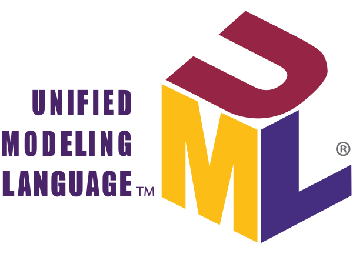
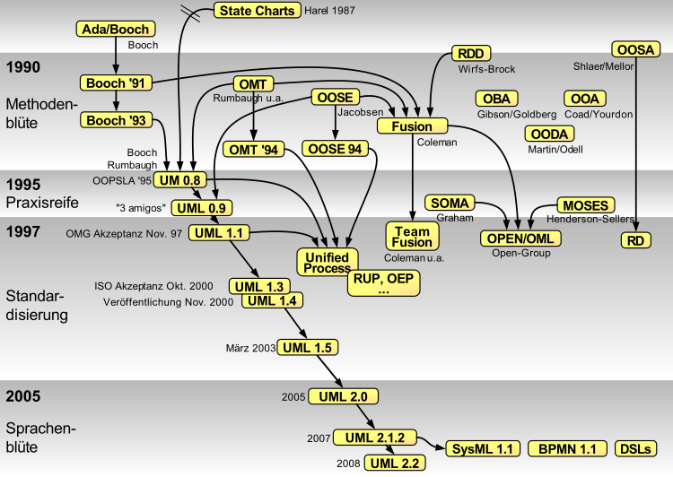
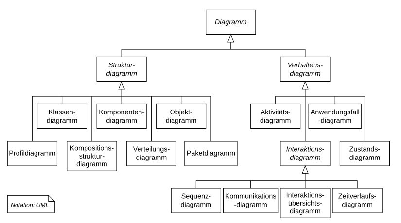
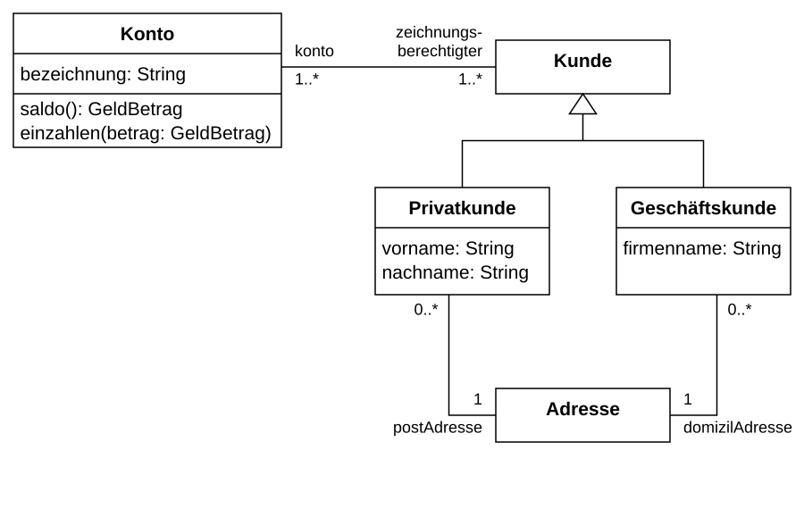
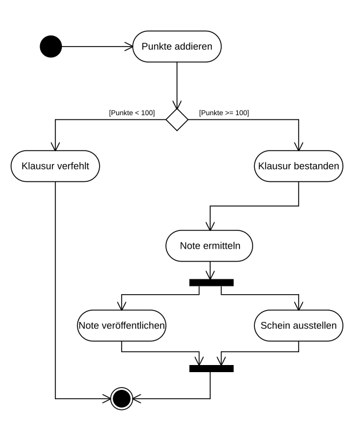
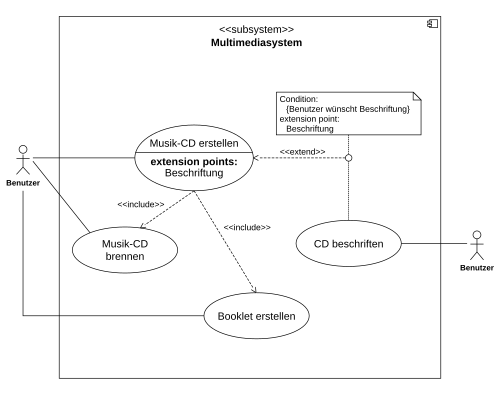
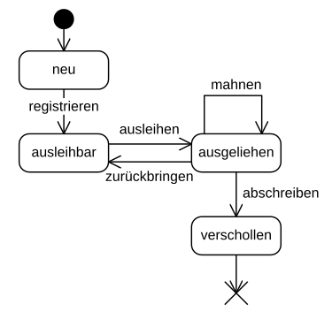
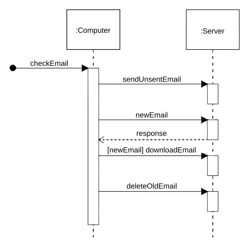
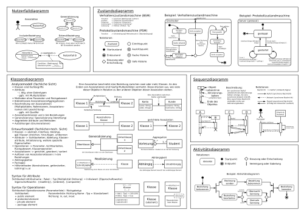

# Einführung in UML

---

##  Navigation

###  Zu den Unterseiten (Diagrammtypen)

- [Klassendiagramm](klassendiagramm/index.md)
- [Aktivitätsdiagramm](aktivitaetsdiagramm/index.md)
- [Anwendungsfalldiagramm](anwendungsfalldiagramm/index.md)
- [Zustandsdiagramm](zustandsdiagramm/index.md)
- [Sequenzdiagramm](sequenzdiagramm/index.md)

---

###  Zu den Abschnitten auf dieser Seite

- [Kurze Einführung in UML](#kurze-einführung-in-die-uml)
- [ UML in der IHK-Prüfung](#-uml-in-der-ihk-prüfung)
- [ Überblick Diagrammtypen](#überblick-diagrammtypen)
- [ Überblick Notation](#überblick-notation)
- [ Tools zur Erstellung](#mögliche-tools-zur-erstellung)
- [ Ressourcen](#ressourcen)

---

## Kurze Einführung in die UML

### Definition
UML (Unified Modeling Language) ist eine standardisierte grafische Sprache zur Spezifikation, Visualisierung und Dokumentation von Software- und Systemarchitekturen.

### Verwendung
- Analyse und Design: Abbildung von Anforderungen und Architektur
- Kommunikation: Gemeinsame Sprache zwischen Stakeholdern
- Dokumentation: Nachvollziehbare Projektdokumente

### Praxisrelevanz
- Reduziert Missverständnisse im Team
- Beschleunigt Einarbeitung neuer Entwickler
- Erleichtert Wartung und Erweiterung bestehender Systeme

### Historie
- Mitte 1990er Jahre: Konsolidierung mehrerer Modellierungsmethoden (Booch, OMT, OOSE)
- 1997: Erste UML-Version von der OMG verabschiedet
- Seitdem kontinuierliche Weiterentwicklung (aktuell UML 2.x)

### OOP-Bezug
UML wurde primär für objektorientierte Systeme entworfen. Klassen, Objekte, Vererbung und Schnittstellen lassen sich direkt visualisieren.

[↑ zurück nach oben](#einführung-in-uml)

---

##  UML in der IHK-Prüfung

In den IHK-Prüfungen für Fachinformatiker (Anwendungsentwicklung / Systemintegration) wird UML regelmäßig als Werkzeug zur Planung und Visualisierung eingesetzt.

---

###  AP1

- **Ziel**: Verständnis für grundlegende Diagrammtypen und deren Erstellung
- Diagrammarten wie Klassendiagramme, Aktivitätsdiagramme oder Anwendungsfalldiagramme werden häufig verlangt.
- Fokus liegt auf **theoretischem Wissen**, **Diagrammverständnis** und **korrekter Notation**.

[↑ zurück nach oben](#einführung-in-uml)

---

### AP2

- Häufig genutzte Diagrammtypen:
  - **Anwendungsfalldiagramme**
  -  **Klassendiagramme**
  -  **Aktivitätsdiagramme**
  -  **Sequenzdiagramme**
  -  **Zustandsdiagramme**
- Sie dienen zur Darstellung:
  - von **Strukturen und Abläufen**
  - von **Systeminteraktionen**
  - zur **Visualisierung der Umsetzungsschritte**

[↑ zurück nach oben](#einführung-in-uml)

---

###  Einsatz von UML-Diagrammen in der IHK-Dokumentation

UML-Diagramme unterstützen eine **bessere Verständlichkeit** und wirken sich positiv auf folgende Bewertungskriterien aus:

-  *Dokumentation der Lösung*
-  *Nachvollziehbarkeit der technischen Umsetzung*
-  *Visualisierung komplexer Zusammenhänge*

| Abschnitt der Projektdokumentation        | Empfohlene UML-Diagrammtypen                        | Nutzen                                                   |
|------------------------------------------|------------------------------------------------------|----------------------------------------------------------|
| **Projektbeschreibung**                  | Anwendungsfalldiagramm                              | Darstellung der Anforderungen aus Nutzersicht            |
| **Analyse / Ist-Zustand**                | Aktivitäts- oder Klassendiagramm                    | Struktur und Abläufe im aktuellen System                 |
| **Technische Umsetzung / Planung**       | Klassendiagramm, Sequenzdiagramm, Zustandsdiagramm  | Struktur, Interaktionen und Zustandsveränderungen        |
| **Qualitätssicherung / Testszenarien**   | Zustands- oder Aktivitätsdiagramm                   | Dokumentation von Systemverhalten unter Testbedingungen  |

[↑ zurück nach oben](#einführung-in-uml)

---

## Überblick der 14 Diagrammtypen

**Hinweis:**

- *Kursiv dargestellte Begriffe* dienen **nur der Organisation und Strukturierung** des Diagramms (z. B. „Interaktionsdiagramme“ oder „Strukturdiagramme“).
- Diese kursiven Begriffe sind **keine offiziellen UML-Diagrammtypen**.
- **Konkrete UML-Diagrammtypen** sind in **normaler Schrift** dargestellt

### Tabelle zu den 5 IHK-relevanten Diagrammtypen

| Diagrammtyp               | Kurzbeschreibung                                                      | Beispielgrafik                |
|---------------------------|------------------------------------------------------------------------|-------------------------------|
| [Klassendiagramm](klassendiagramm/index.md)           | Statische Struktur: Klassen, Attribute, Methoden, Beziehungen          |   |
| [Aktivitätsdiagramm](aktivitaetsdiagramm/index.md)       | Ablauf von Aktionen und Workflows (ähnlich Flussdiagramm)              | |
| [Anwendungsfalldiagramm](anwendungsfalldiagramm/index.md)    | Nutzer-System-Interaktionen, Anforderungen aus Nutzersicht            |  |
| [Zustandsdiagramm](zustandsdiagramm/index.md))          | Lebenszyklus eines Objekts: Zustände und Zustandsübergänge             |  |
| [Sequenzdiagramm](sequenzdiagramm/index.md)           | Zeitliche Abfolge von Nachrichten und Methodenaufrufen zwischen Objekten|    |

[↑ zurück nach oben](#einführung-in-uml)

---

## Überblick Notation

[↑ zurück nach oben](#einführung-in-uml)

---

## Mögliche Tools zur Erstellung

Sie können das Diagramm auf verschiedene Arten umsetzen:

- **Papier und Stift** (dann digitalisieren, z. B. per Foto oder Scan)
- **Dia** (kostenloses UML-Tool - wird im LinkedIn-Learning-Kurs verwendet)
- **Excalidraw**
- **draw.io**
- **Lucidchart**

### textbasierte Visualisierungstools
- **PlantUML** (textbasierte UML-Erstellung)
- **mermaid** (integrierbar in md)

[↑ zurück nach oben](#einführung-in-uml)

---

## Ressourcen

- **PlantUML**
  - [Aktivitätsdiagramme mit PlantUML](https://oer-informatik.de/uml-aktivitaetsdiagramm-plantuml)
  - [PlantUML-Server](https://www.plantuml.com/plantuml/uml/SyfFKj2rKt3CoKnELR1Io4ZDoSa700003)
- [Wikipedia: UML](https://de.wikipedia.org/wiki/Unified_Modeling_Language)
- [Offizielle UML-Spezifikation (OMG)](https://www.omg.org/spec/UML/2.5.1/About-UML/)
- **LinkedIn Learning: Ralph Steyer**
  - [Anwendungsfall-, Objekt- und Sequenzdiagramm](https://www.linkedin.com/learning/uml-anwendungsfall-objekt-und-sequenzdiagramme/)
  - [Klassendiagramm](https://www.linkedin.com/learning/klassendiagramme-mit-uml)

[↑ zurück nach oben](#einführung-in-uml)
