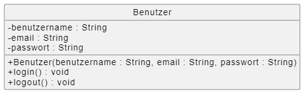
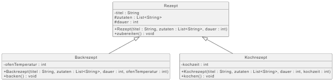
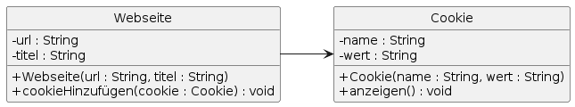
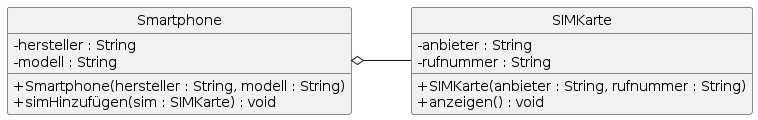
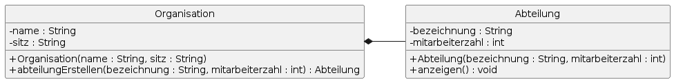

# Einführung ins Klassendiagramm

## Definition
Ein Klassendiagramm zeigt die statische Struktur eines Systems durch Klassen, deren Attribute, Methoden und die Beziehungen untereinander.

## Zweck & Verwendung
- **Modellierung der Domäne**: Abbildung von Geschäftsobjekten  
- **Architekturentwurf**: Festlegung von Klassenhierarchien und Schnittstellen  
- **Dokumentation**: Grundlage für Implementierung und Wartung

## Praxisrelevanz
- Klarheit über Systemstruktur und Verantwortlichkeiten  
- Vermeidung von Redundanzen durch klare Beziehungen  
- Unterstützt Code-Generierung und API-Design

## Grundelemente
- **Klasse**: Rechteck mit Namen, Attributen, Methoden  
- **Attribut**: Variable in einer Klasse (Sichtbarkeit + Name + Typ)  
- **Methode**: Operation in einer Klasse (Sichtbarkeit + Name + Parameter + Rückgabetyp)  
- **Sichtbarkeiten**: `+` public, `-` private, `#` protected, `~` package  
- **Beziehungen**:
  - **Vererbung**: Pfeil mit offenem Dreieck  
  - **Assoziation**: Linie zwischen Klassen  
  - **Aggregation**: leeres Rautenende  
  - **Komposition**: ausgefülltes Rautenende  
  - **Abhängigkeit**: gestrichelte Linie mit Pfeil  
  - **Realisierung**: gestrichelter Pfeil mit offenem Dreieck

- Beispiel  *Klassensymbol*

- Beispiel *Vererbung*

- Beispiel *(gerichtete) Assoziation*

- Beispiel *Aggregation*

- Beispiel *Komposition*

## OOP-Bezug
Klassendiagramme sind das Herzstück objektorientierter Analyse und dienen als Blaupause für Code in Sprachen wie Java oder C#.

## Tools & Links
-  [Ralph Steyer: LinkedinLearning: Klassendiagramm](https://www.linkedin.com/learning/klassendiagramme-mit-uml)
- [Wikipedia](https://de.wikipedia.org/wiki/Klassendiagramm)
- [(kurzer) Einstieg in die OOP mit dem Klassendiagramm](https://oer-informatik.de/uml-klassendiagramm)
- **PlantUML**:
  - [Klassendiagramm](https://plantuml.com/class-diagram)  
- **Mermaid**: [Markdown-in­te­griert](https://mermaid.js.org/syntax/classDiagram.html)

