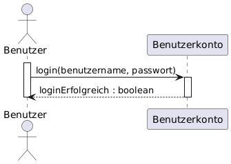
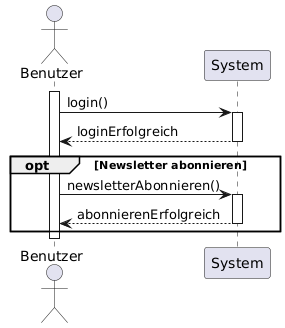
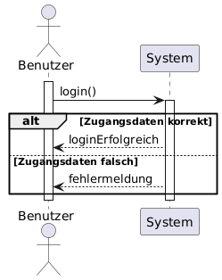
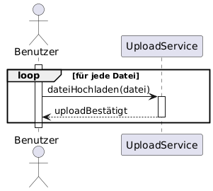

# Einführung ins Sequenzdiagramm

## Definition
Ein Sequenzdiagramm visualisiert die zeitliche Abfolge von Nachrichten (Methodenaufrufen) zwischen Objekten innerhalb eines Szenarios.

## Zweck & Verwendung
- **Verhaltensmodellierung**: Darstellung von Interaktionen in Use Cases oder Anwendungsfällen  
- **Design**: Festlegung von Kollaborationsabläufen zwischen Komponenten  
- **Dokumentation**: Nachvollziehbare Sequenz für Entwickler und Tester

## Praxisrelevanz
- Klare Sicht auf Kommunikationsfluss und zeitliche Abhängigkeiten  
- Erkennung von Engpässen oder unübersichtlichen Abläufen  
- Grundlage für Mocking und Test-Skripte

## Grundelemente
- **Lebenslinie**: Vertical gestrichelte Linie unter einem Objekt- oder Rollen-Namen  
- **Aktivierungsbalken**: Rechter Winkel auf der Lebenslinie, zeigt Ausführungszeitraum  
- **Nachricht**: Pfeil von Sender zu Empfänger, beschriftet mit Methodenname und Parameter  
- **Synchron / Asynchron**: Voll/pfeilspitze oder offen/pfeilspitze  
- **Rückgabe**: Gegengerichteter gestrichelter Pfeil mit Rückgabewert  
- **Fragment (Optional)**: Bedingte/Schleifenbereiche mit Rahmen (alt, loop, opt)

- Beispiel  *Grundsymbole*

- Beispiel  *Opt-Fragement*

- Beispiel  *Alt-Fragement*

- Beispiel  *loop-Fragement*

## OOP-Bezug
Sequenzdiagramme verdeutlichen, welche Methoden in welcher Reihenfolge auf Klassen und Objekte wirken und unterstützen so das API- und Interface-Design.

## Tools & Links
- **PlantUML**: Sequenzdiagramm-Syntax – https://plantuml.com/sequence-diagram  
- **Mermaid**: Markdown-in­te­griert – https://mermaid.js.org/syntax/sequenceDiagram.html
