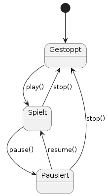
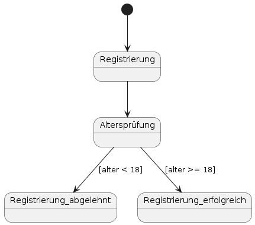

# Einführung ins Zustandsdiagramm

## Definition
Ein Zustandsdiagramm (Statechart) beschreibt die Zustände eines Objekts und die Übergänge zwischen diesen Zuständen.

## Zweck & Verwendung
- **Verhaltensmodellierung**: Abbildung des Lebenszyklus von Objekten  
- **Analyse**: Erkennung gültiger und ungültiger Zustandswechsel  
- **Dokumentation**: Klarer Überblick über Zustandslogik für Entwickler und Tester

## Praxisrelevanz
- Vermeidung von unvorhergesehenen Zustandsfehlern  
- Grundlage für ereignisgesteuerte Implementierungen  
- Bessere Testabdeckung durch Zustandsübergangsdiagramme

## Grundelemente
- **Initialzustand**: Gefüllter Kreis  
- **Zustand**: Rechteck mit abgerundeten Ecken und Zustandsname  
- **Endzustand**: Gefüllter Kreis in Kreis  
- **Transition**: Pfeil mit Ereignis/Bedingung  
- **Guard-Bedingung**: `[Bedingung]` am Übergang  
- **Aktion**: `/Aktion()` am Übergang  
- **Composite States**: Hierarchische Zustände mit Sub-Zuständen  
- **Fork/Join**: Balken zur Parallelisierung und Synchronisation

 - Beispiel: Musikplayer-Zustände

- Beispiel mit Wächterausdrücken:  Benutzerregistrierung mit Altersprüfung

## OOP-Bezug
Zustandsdiagramme verknüpfen sich mit Klassen, indem sie das Verhalten von Objekten je nach Attributen und Ereignissen strukturieren.

## Tools & Links
- **PlantUML**: Statechart-Syntax – https://plantuml.com/state-diagram  
- **Mermaid**: Markdown-in­te­griert – https://mermaid.js.org/syntax/stateDiagram.html
